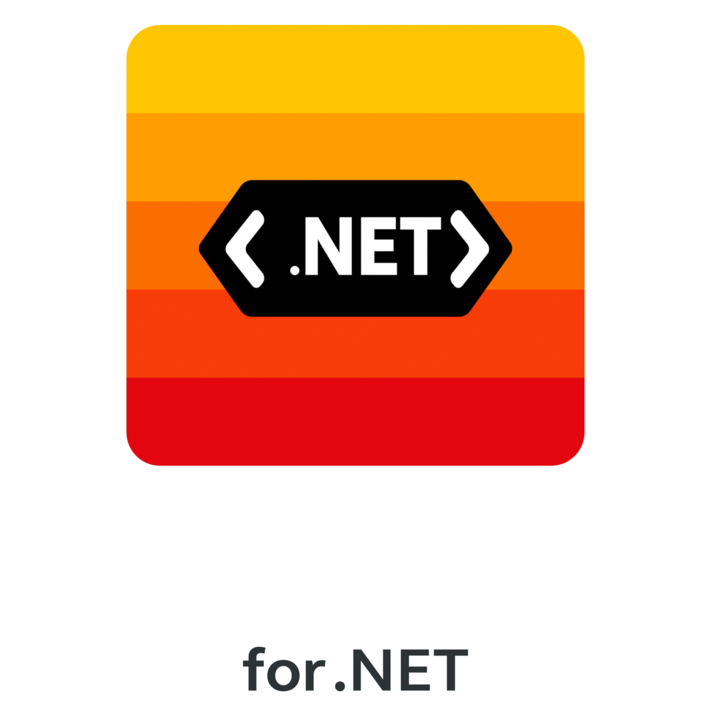

<p align="center">
  
</p>

<h1 align="center">Mistral AI SDK for .NET</h1>

<p align="center">
  A simple and powerful .NET SDK for the <a href="https://mistral.ai/">Mistral AI API</a>
</p>

<p align="center">
  <a href="#features">Features</a> •
  <a href="#quick-start">Quick Start</a> •
  <a href="#documentation">Documentation</a> •
  <a href="#license">License</a>
</p>

---

## Features

- Chat completion API with full parameter support
- **Streaming responses** with `IAsyncEnumerable`
- All Mistral models (Large, Small, Codestral, Pixtral...)
- JSON mode and JSON Schema support
- Stop sequences, penalties, and sampling controls
- Async/await with cancellation support
- Dependency Injection ready
- Custom exception handling
- Response caching

## Installation

```bash
dotnet add reference path/to/MistralSDK.csproj
```

## Quick Start

```csharp
using MistralSDK;
using MistralSDK.ChatCompletion;

// Create client
var apiKey = Environment.GetEnvironmentVariable("MISTRAL_API_KEY");
using var client = new MistralClient(apiKey);

// Send a request
var request = new ChatCompletionRequest
{
    Model = MistralModels.Small,
    Messages = new List<MessageRequest>
    {
        new MessageRequest { Role = MessageRoles.User, Content = "Hello!" }
    }
};

var response = await client.ChatCompletionAsync(request);

if (response.IsSuccess)
{
    Console.WriteLine(response.Message);
}
```

## Streaming

```csharp
await foreach (var chunk in client.ChatCompletionStreamAsync(request))
{
    Console.Write(chunk.GetContent());
}
```

## With Dependency Injection

```csharp
// Register
builder.Services.AddMistralClient(options =>
{
    options.ApiKey = builder.Configuration["MistralApi:ApiKey"];
});

// Use
public class MyService
{
    private readonly IMistralClient _client;
    
    public MyService(IMistralClient client) => _client = client;
}
```

## Available Models

| Constant | Description |
|----------|-------------|
| `MistralModels.Large` | Flagship model, top-tier reasoning |
| `MistralModels.Small` | Good balance of speed and quality |
| `MistralModels.Ministral8B` | Efficient for edge deployment |
| `MistralModels.Codestral` | Optimized for code generation |

## Multi-Turn Conversation

Build chatbots with context - the SDK maintains conversation history:

```csharp
var conversation = new List<MessageRequest>
{
    MessageRequest.System("You are a helpful assistant."),
    MessageRequest.User("What is the capital of France?")
};

var response = await client.ChatCompletionAsync(new ChatCompletionRequest
{
    Model = MistralModels.Small,
    Messages = conversation
});

// Add response to history for context
conversation.Add(MessageRequest.Assistant(response.Message));
conversation.Add(MessageRequest.User("And what's the population?"));

// The AI remembers we're talking about Paris!
var followUp = await client.ChatCompletionAsync(new ChatCompletionRequest
{
    Model = MistralModels.Small,
    Messages = conversation
});
```

See the [complete chat example](docs/getting-started.md#multi-turn-conversation-chat-with-context) in the documentation.

## Documentation

For detailed documentation, see the [docs](docs/) folder:

- [Getting Started](docs/getting-started.md) - First steps and chat examples
- [Configuration](docs/configuration.md)
- [Streaming](docs/streaming.md)
- [Dependency Injection](docs/dependency-injection.md)
- [Error Handling](docs/error-handling.md)
- [Caching](docs/caching.md)
- [Testing](docs/testing.md)
- [API Reference](docs/api-reference.md)

## Requirements

- .NET 8.0+
- Mistral AI API key ([Get one here](https://console.mistral.ai/))

## License

MIT License - see [LICENSE](LICENSE) for details.
